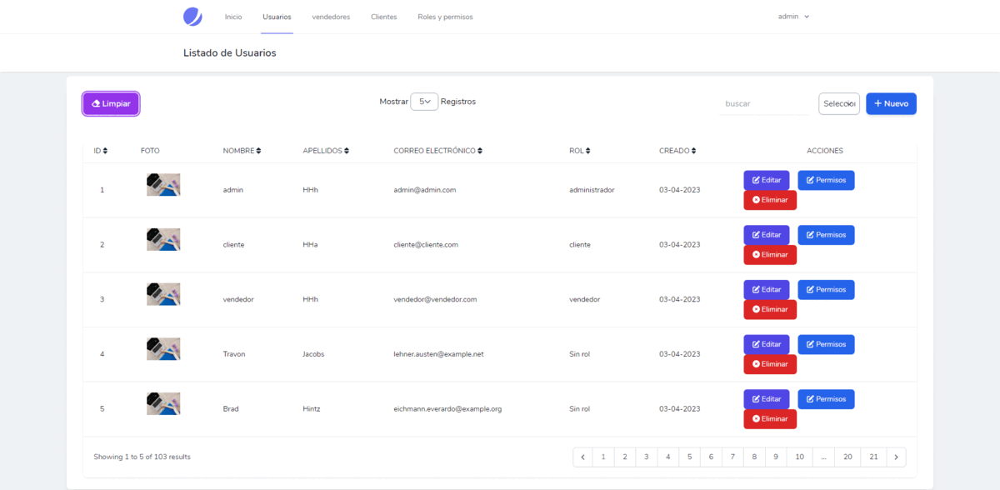

<div align="center">

<h1> DataTables avanzado con Laravel Livewire  </h1>

[]()
[](https://github.com/kylelobo/The-Documentation-Compendium/issues)
[](https://github.com/kylelobo/The-Documentation-Compendium/pulls)
[](/LICENSE)

## 📖 Descripción del proyecto <a name="-descripción-del-proyecto-"></a>

<p>"Este es un proyecto de ejemplo que muestra cómo crear un datatable avanzado con Laravel, Livewire y el stack TALL, que incluye filtros, relaciones, roles y permisos."

## 🥇 DEMO 🥇 <a name="-demo--"></a>

</p>
</div>

<div align="center">
<p align="center">
  <a href="" rel="demo">
 </a>
</p>
</div>

---

<h2> 📝 Tabla de contenido </h2>

- [📖 Descripción del proyecto ](#-descripción-del-proyecto-)
- [🥇 DEMO 🥇 ](#-demo--)
- [🏁 Tecnología utilizados ](#-tecnología-utilizados-)
  - [📒 Prerrequisitos ](#-prerrequisitos-)
  - [🚀 Clonar ](#-clonar-)
  - [🎈 Uso ](#-uso-)
- [👨‍💻 Desarrollador](#-desarrollador)

## 🏁 Tecnología utilizados <a name="-tecnología-utilizados-"></a>

Este proyecto se ha desarrollado utilizando las siguientes tecnologías:

-   `PHP` - Lenguaje de programación utilizado por Laravel.
-   `Laravel` - Framework PHP utilizado para desarrollar la aplicación.
-   `Livewire` - Biblioteca de Laravel para crear componentes de interfaces de usuario.
-   `Alpine.js` - Framework JavaScript para crear interactividad en el front-end.
-   `Tailwind CSS` - Framework CSS utilizado para el diseño de la interfaz.
-   `Laravel-permission` - Biblioteca de Laravel para gestionar roles y permisos.

### 📒 Prerrequisitos <a name="-prerrequisitos-"></a>

-   PHP versión 8.1 o superior.
-   Composer.
-   MySQL.
-   Un servidor web (por ejemplo, Apache o Nginx).
-   Es necesario conocer del stack TALL en nivel básico
-   Editor de código
-   Muchas ganas de seguir aprendiendo 👍
-

### 🚀 Clonar <a name="-clonar-"></a>

Seguir los siquientes pasos consecutivos - utiliza uno de ellos

```
git@github.com:cybertcode/LIVEWIRE-CRUD-PERMISOS-ROLES-DATATABLE.git

ó

https://github.com/cybertcode/LIVEWIRE-CRUD-PERMISOS-ROLES-DATATABLE.git

```

### 🎈 Uso <a name="-uso-"></a>

-   En el terminal

    ```
    composer install
    cp .env.example .env
    php artisan key:generate
    ```

-   Crear tu base de datos
-   Cambiar los datos de usuario

    ```
    DB_DATABASE=datatables-livewire
    DB_USERNAME=root
    DB_PASSWORD=
    ```

-   Cambiar el driver de local a public

    ```
    # FILESYSTEM_DISK=public
    ```

-   En el terminal

    ```
    php artisan migrate
    php artisan db:seed
    php artisan serve
    npm run dev
    ```

-   En el terminal
    ```
      php artisan storage:link
    ```
-   Configurar correctamente su ruta según sea tu caso

    ```
    APP_URL=http://127.0.0.1:8000
    ```

-   Datos de acceso
    -   Correo: **admin@admin.com**
    -   Contraseña: **admin123**

## 👨‍💻 Desarrollador<a name="desarrollador"></a>

<div  align="center">

[](https://github.com/cybertcode)

[](https://github.com/cybertcode)

<p align="center">
   Mis redes sociales :<br/><br/>
    <a href="https://www.linkedin.com/in/marvyn-kevyn-huanca-hilario-a12699b7/"></a>
    <a href="https://www.facebook.com/profile.php?id=100047330599374"></a>
    <a href="https://gitlab.com/cybert22"></a>
    <a href="https://www.instagram.com/mkevynhh"></a>
    <a href="https://www.twitch.tv/cybert22"></a>
    <a href="https://twitter.com/Kevyn94"></a>
</p>

</div>

---

</br>
<div align="center">
<p align="center"> © 2023 Cybertcode, todos los derechos Reservados. Hecho con mucho ❤️ . </p>
<p align="center">
https://www.cybertcode.com
</p>
</div>
